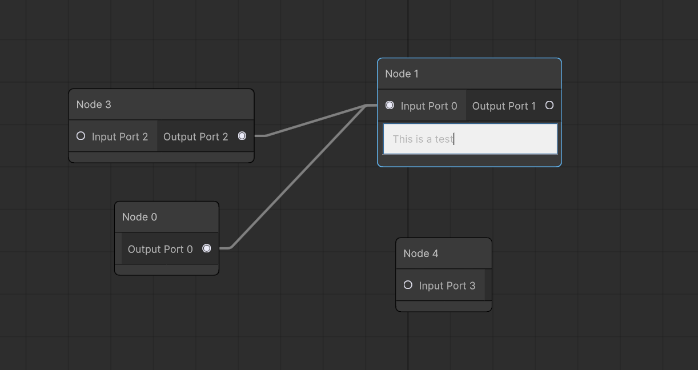

# Graph View Player 

Graph View Player is a _deeply_ refactored version of GraphViewEditor from Unity. Most features have been removed. All that remains are Nodes, Edges, and Ports. No stackable nodes, no collapsible titles, no selection undo/redo, etc.

The two main goals of this project were to make a node editor that:
- Would run in the Unity player
- Would allow for an asynchronous storage backend rather than default to using ScriptableObjects

So far so good! The code should be functional and I'll be improving here and there as I make use of the code for a cross platform dialogue system I'm building.